# Web3 Pi UPS

**Open-source DC Uninterruptible Power Supply for Raspberry Pi 5**

<p align="center">
  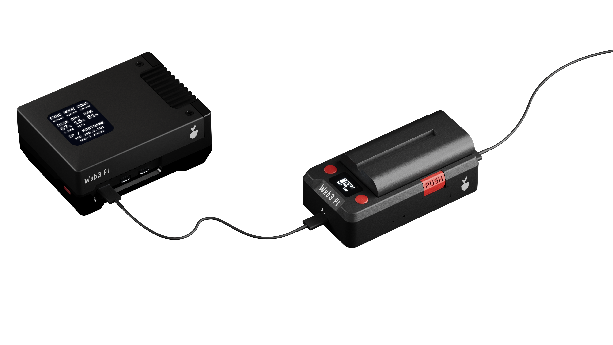
</p>

The Web3 Pi UPS is a purpose-built, compact DC UPS designed specifically for the Raspberry Pi 5. Born from the [Web3 Pi](https://www.web3pi.io) project — a platform for running Ethereum nodes on Raspberry Pi — it exists because nothing else on the market solved the problem properly.

Running an Ethereum node requires 24/7 uptime. A power outage doesn't just interrupt service — it can corrupt the node database, requiring hours or even days of re-synchronization. For solo stakers, downtime means missed attestations and real financial penalties. We needed a UPS that actually fits the Raspberry Pi form factor, and when we couldn't find one, we built it ourselves.

## Why Not an Existing UPS?

Traditional UPS units are massive compared to a Raspberry Pi. They convert mains AC to DC to charge a battery, then invert DC back to AC for output, only for your Raspberry Pi's power supply to convert it back to DC again. Each conversion wastes energy and generates heat.

HAT-style UPS boards for Raspberry Pi stack on top via GPIO, making them incompatible with most enclosures and adding mechanical complexity.

**Web3 Pi UPS takes a different approach.** It sits between your charger and the Raspberry Pi, connected by a single USB-C cable. No GPIO, no stacking, no enclosure conflicts. It's a true DC UPS — power flows from input to battery to output without any AC conversion. Compact, silent, and efficient.

<p align="center">
  
</p>

## Key Features

### Three Independent Power Sources

The UPS accepts power from three sources — any single one is enough to keep the output running:

- **USB-C PD input** (12-20V, 27W+) — primary power from a USB-C PD charger
- **DC barrel jack** (9-24V) — alternative input for standard DC power supplies
- **Sony NP-F battery** — backup power when both external sources are lost

The power path seamlessly and instantly switches between sources with zero interruption. When external power is present, the battery charges. When external power drops, the battery takes over — no gap, no glitch.

### Sony NP-F Battery Ecosystem

<p align="center">
  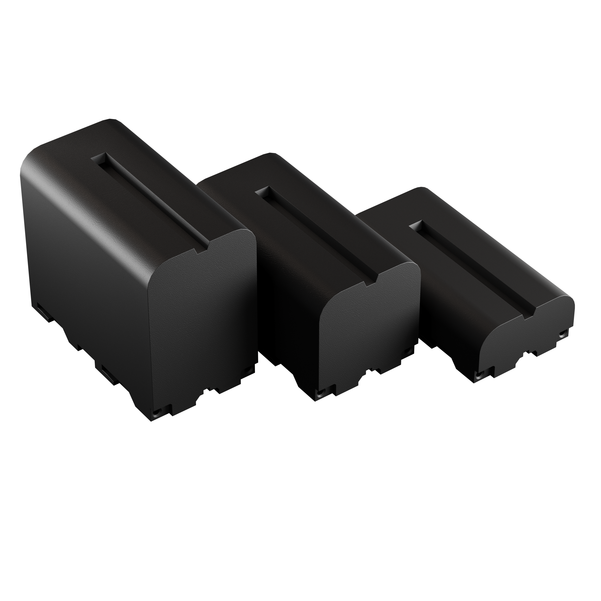
</p>

We chose the Sony NP-F battery system for a reason. These Li-ion cells are one of the most popular battery standards in the world, widely used in photography and videography equipment. You can buy them anywhere — online, in camera stores, globally. They come in multiple capacities to match your needs:

| Battery | Typical Capacity | Approximate Runtime* |
|---------|-----------------|---------------------|
| NP-F570 | 2900 mAh | Shorter runtime, most compact |
| NP-F770 | 5200 mAh | Mid-range |
| NP-F970 | 6600 mAh | Longest runtime |

*Runtime depends on your Raspberry Pi's workload and connected peripherals.*

Batteries are **hot-swappable** — you can replace them while the system is running, as long as external power is connected. No downtime, no shutdown. You can also mix and match different NP-F sizes depending on your use case.

### Single USB-C Cable for Power and Communication

Here's something most people don't know: the USB-C port on the Raspberry Pi 5 isn't just for power. It also supports USB data transfer when enabled in `config.txt`. Web3 Pi UPS takes advantage of this — **one USB-C cable carries both power delivery and a data channel** between the UPS and the Raspberry Pi.

This data link enables:

- **Graceful shutdown** — when battery reaches a critical level, the UPS tells the OS to shut down cleanly, preventing filesystem and database corruption
- **Real-time telemetry** — battery level, charging status, input source, voltage, current, and temperature are all accessible from the Raspberry Pi
- **Remote monitoring** — integrate UPS status into your monitoring stack (Grafana, scripts, etc.)

### Built-in User Interface

The UPS has an OLED display (SSD1306) and two tactile buttons for local status monitoring and configuration — no need to SSH in just to check battery level. An onboard buzzer provides audible alerts for power events.

<p align="center">
  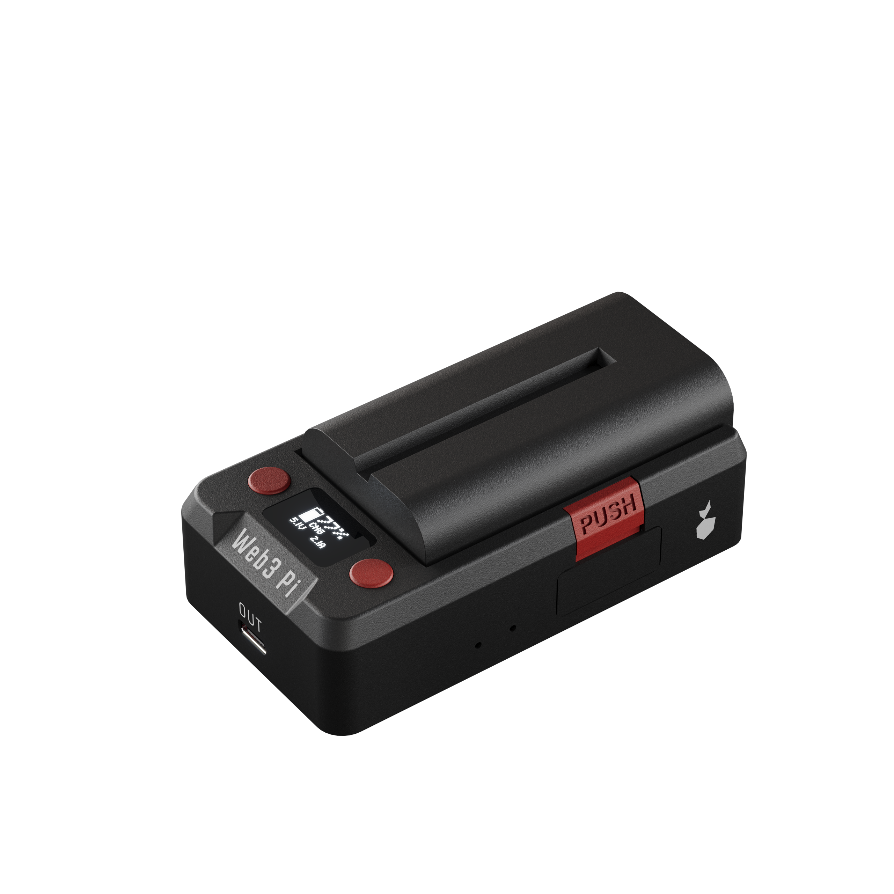
  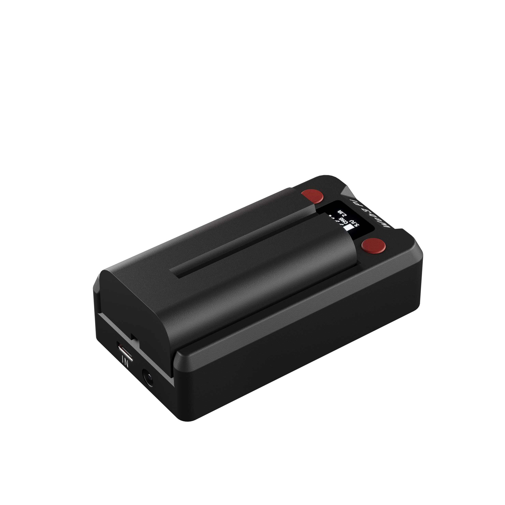
</p>

### USB-C PD Output

The output port supports USB Power Delivery with multiple voltage profiles:

- **5V, 5.1V, 9V, 12V, 15V** — up to **27W** (5A at 5.1V)
- Fully compatible with Raspberry Pi 5 power requirements
- Also works with other USB-C PD powered devices

### Smart Battery Management

The onboard charger (MP2762A) handles 2S Li-ion charging with temperature monitoring via an LM75B sensor. The power path management reduces battery wear by limiting charge when the battery is full — extending its lifespan over hundreds of cycles.

## A Raspberry Pi for Raspberry Pi

A fun detail: the UPS uses a **Raspberry Pi RP2040** microcontroller for the UI panel and system monitoring. So it's a Raspberry Pi-powered device, built for Raspberry Pi.

The main power board uses a **CH32X035** RISC-V MCU with a built-in USB-PD 3.0 PHY for handling power delivery negotiation.

## Technical Summary

| Parameter | Specification |
|-----------|--------------|
| **Output** | USB-C PD: 5V, 5.1V, 9V, 12V, 15V (max 27W) |
| **Input 1** | USB-C PD (12-20V, 27W+) |
| **Input 2** | DC barrel jack (9-24V) |
| **Input 3** | Sony NP-F battery (Li-ion, 2S) |
| **Battery** | Sony NP-F series — NP-F570 / NP-F770 / NP-F970 |
| **Hot-swap** | Yes (with external power connected) |
| **Communication** | USB data over the same USB-C power cable |
| **Display** | SSD1306 OLED |
| **Controls** | 2 tactile buttons + buzzer |
| **MCU (power)** | CH32X035F8U6 (RISC-V, USB-PD 3.0 PHY) |
| **MCU (UI)** | Raspberry Pi RP2040 |
| **DC-DC** | TPS55289 buck-boost (3-30V range) |
| **Charger** | MP2762A (2S Li-ion, temp monitored) |
| **Enclosure** | 3D-printed (FDM), snap-fit assembly |

## Electronics

### Main Board

4-layer PCB with USB-PD controller, charger, DC-DC converter, and NP-F battery connector.

<p align="center">
  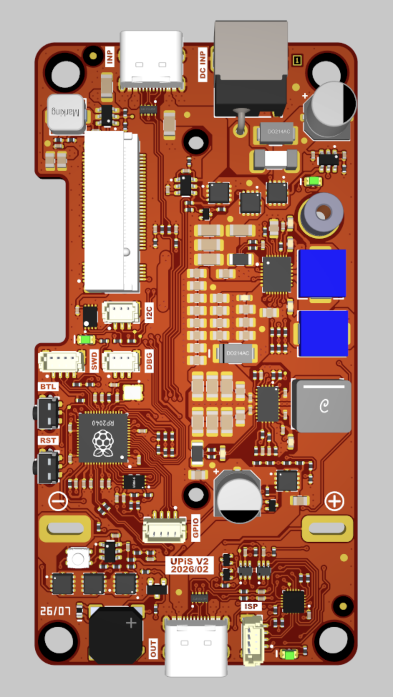
  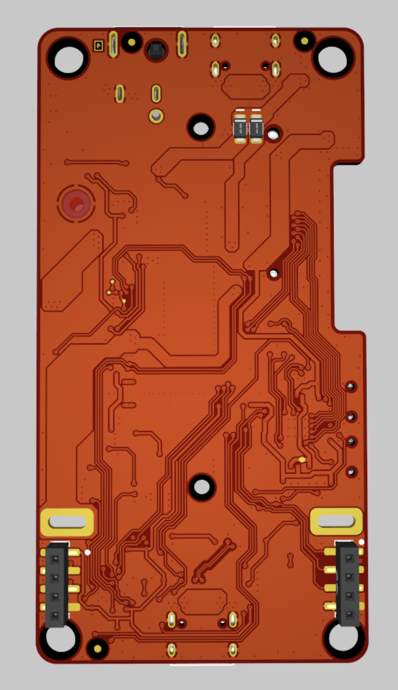
  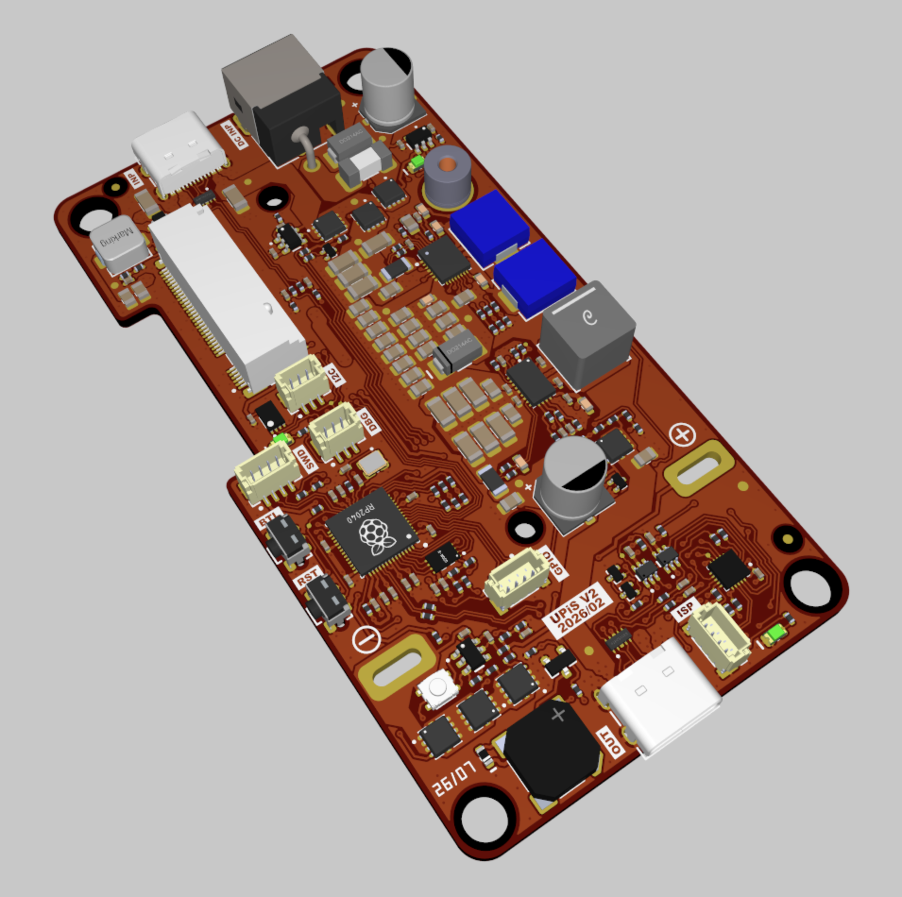
</p>

### UI Panel

2-layer PCB with SSD1306 OLED display, two tactile buttons, and RP2040 controller.

<p align="center">
  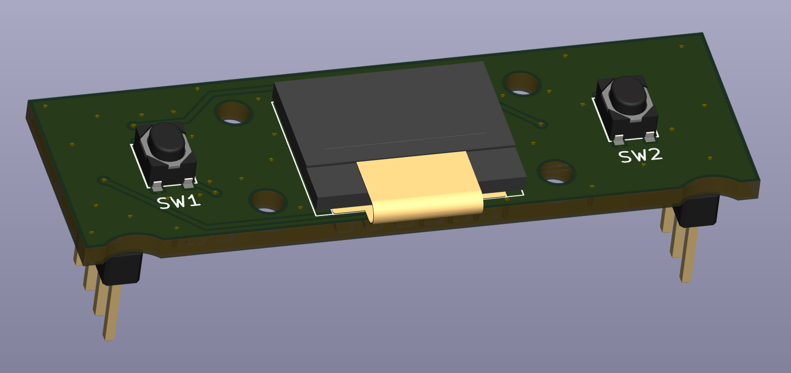
  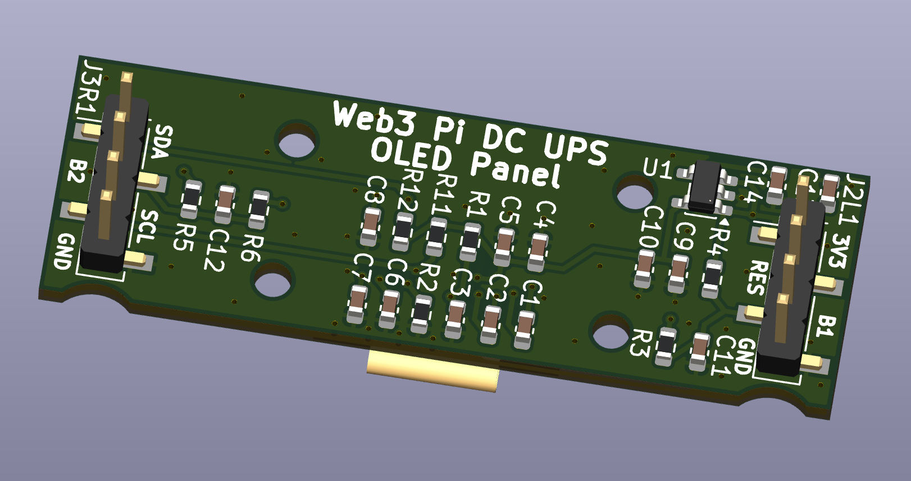
</p>

## Enclosure

3D-printed enclosure designed for FDM printing. Multi-part assembly with snap-fit battery latch.

<p align="center">
  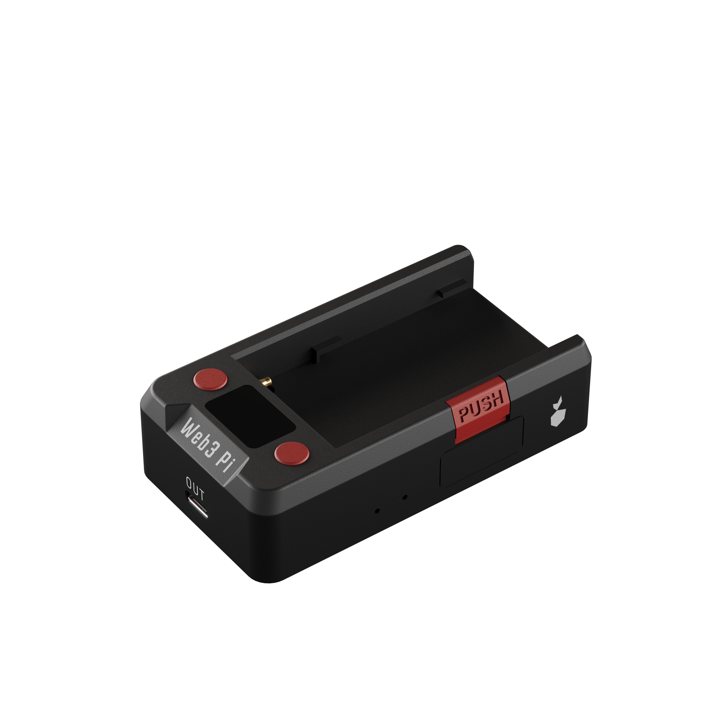
  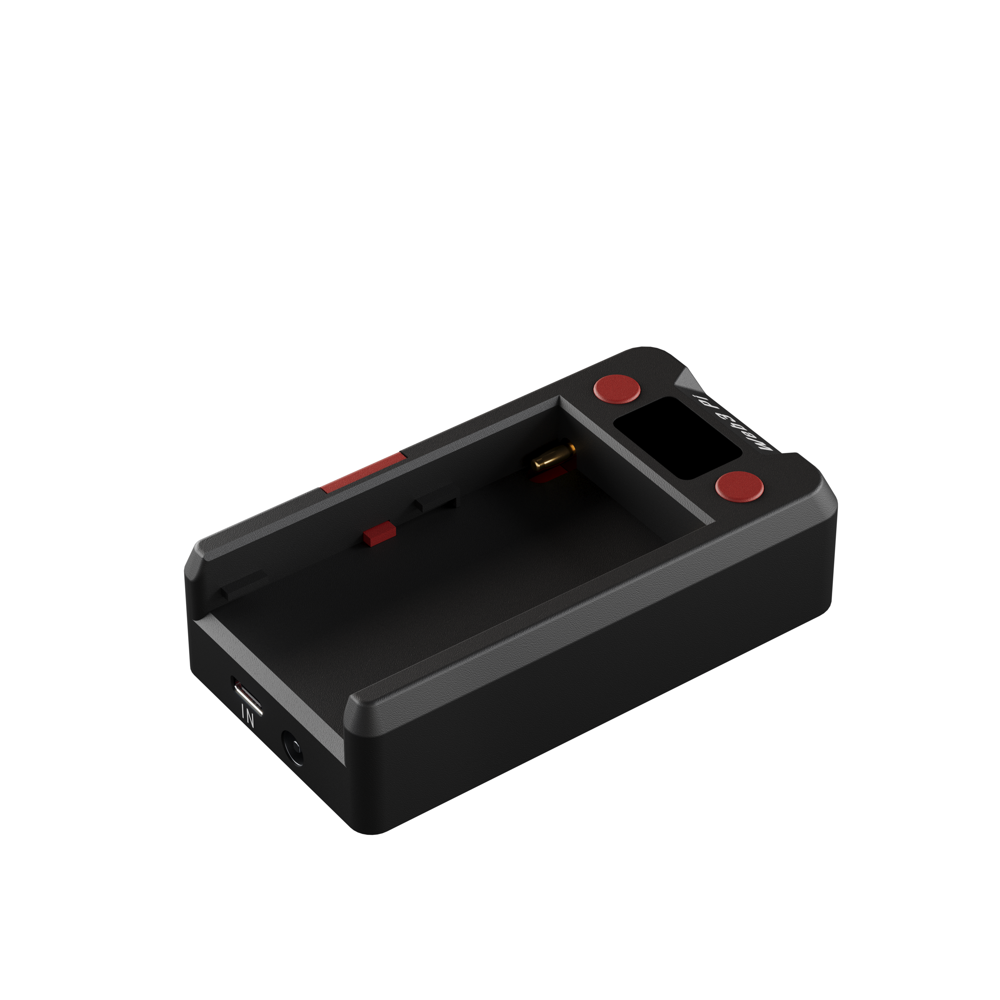
</p>

**Parts:** Enclosure Main, Enclosure Bottom, Side Cover, Buttons, Lock, Press Lock Button, OLED Dimmed Window

Full STEP assembly: [`hardware/enclosure/Web3_Pi_UPS_3DPrinted.step`](hardware/enclosure/Web3_Pi_UPS_3DPrinted.step)

## Repository Structure

```
firmware-ch32x/                     CH32X035 firmware — USB-PD source, power management
firmware-rp2040/                    RP2040 firmware — OLED UI, status display, buttons
service/                            Linux system service (planned)
hardware/
├── electronics/
│   ├── main-board/                 Main power board — schematic, STEP, Gerber, BOM, PnP
│   └── ui-panel/                   OLED + buttons panel — schematic, STEP, Gerber, BOM
└── enclosure/                      3D-printed enclosure — STEP assembly, STL parts
docs/images/                        Renders and photos
```

## Building

### CH32X035 Firmware

Requires MounRiver Studio toolchain or `riscv-none-embed-gcc`.

### RP2040 Firmware

Requires [PlatformIO](https://platformio.org/). Build and upload:

```bash
cd firmware-rp2040
pio run -t upload
```

## Links

- [Web3 Pi UPS — product page](https://www.web3pi.io/products/ups)
- [Web3 Pi — project homepage](https://www.web3pi.io)

## License

This project uses dual licensing:

| Component | License | File |
|-----------|---------|------|
| `firmware-rp2040/`, `firmware-ch32x/`, `service/` | [GPL-3.0](LICENSE-SOFTWARE) | `LICENSE-SOFTWARE` |
| `hardware/` | [CERN-OHL-S v2](LICENSE-HARDWARE) | `LICENSE-HARDWARE` |

---

*Disclaimer: Raspberry Pi is a trademark of Raspberry Pi Ltd. Sony NP-F is a trademark of Sony Corporation. The use of these trademarks here is solely for descriptive purposes.*
