# Web3 Pi UPS

**Open-source DC Uninterruptible Power Supply for Raspberry Pi 5**

**[Product page](https://www.web3pi.io/products/ups)** · **[Watch on YouTube](https://www.youtube.com/watch?v=3EgSPatHWfY)** · **[Web panel](https://panel.web3pi.io)** · **[User guide](https://docs.web3pi.io/ups/)**

<p align="center">
  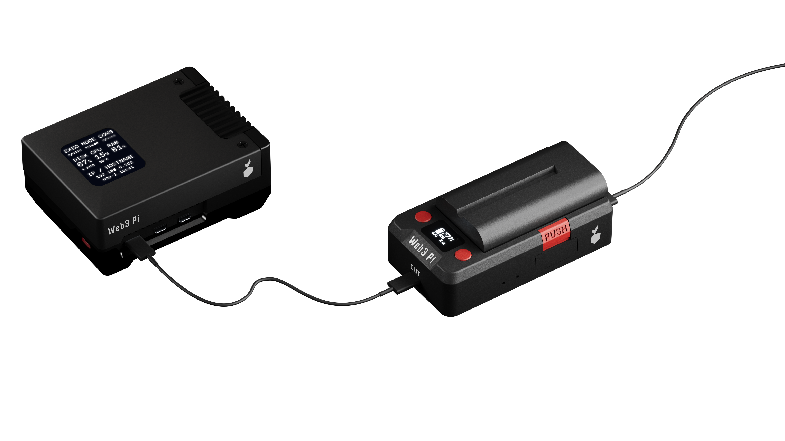
</p>

Start with the [hardware quick start](docs/QuickStart.md), then install the
[Raspberry Pi host service](https://github.com/Web3-Pi/Web3-Pi-UPS-Service)
for OS telemetry and graceful shutdown. Firmware builds and the companion
projects are listed below.

The Web3 Pi UPS is a purpose-built, compact DC UPS designed specifically for the Raspberry Pi 5. Born from the [Web3 Pi](https://www.web3pi.io) project — a platform for running Ethereum nodes on Raspberry Pi — it exists because nothing else on the market solved the problem properly.

Running an Ethereum node requires 24/7 uptime. A power outage doesn't just interrupt service — it can corrupt the node database, requiring hours or even days of re-synchronization. For solo stakers, downtime means missed attestations and real financial penalties. We needed a UPS that actually fits the Raspberry Pi form factor, and when we couldn't find one, we built it ourselves.

## Why Not an Existing UPS?

Traditional UPS units are massive compared to a Raspberry Pi. They convert mains AC to DC to charge a battery, then invert DC back to AC for output, only for your Raspberry Pi's power supply to convert it back to DC again. Each conversion wastes energy and generates heat.

HAT-style UPS boards for Raspberry Pi stack on top via GPIO, making them incompatible with most enclosures and adding mechanical complexity.

**Web3 Pi UPS takes a different approach.** It sits between your charger and the Raspberry Pi, connected by a single USB-C cable. No GPIO, no stacking, no enclosure conflicts. It's a true DC UPS — power flows from input to battery to output without any AC conversion. Compact, silent, and efficient.

<p align="center">
  
</p>

## Key Features

### Three Independent Power Sources

The UPS accepts power from three sources — any single one is enough to keep the output running:

- **USB-C PD input** (9–20 V profiles, selected through HUSB238) — primary power from a USB-C PD charger
- **DC barrel jack** (12–20 V) — alternative input for standard DC power supplies
- **Sony NP-F battery** — backup power when both external sources are lost

The power path seamlessly and instantly switches between sources with zero interruption. When external power is present, the battery charges. When external power drops, the battery takes over — no gap, no glitch.

### Sony NP-F Battery Ecosystem

<p align="center">
  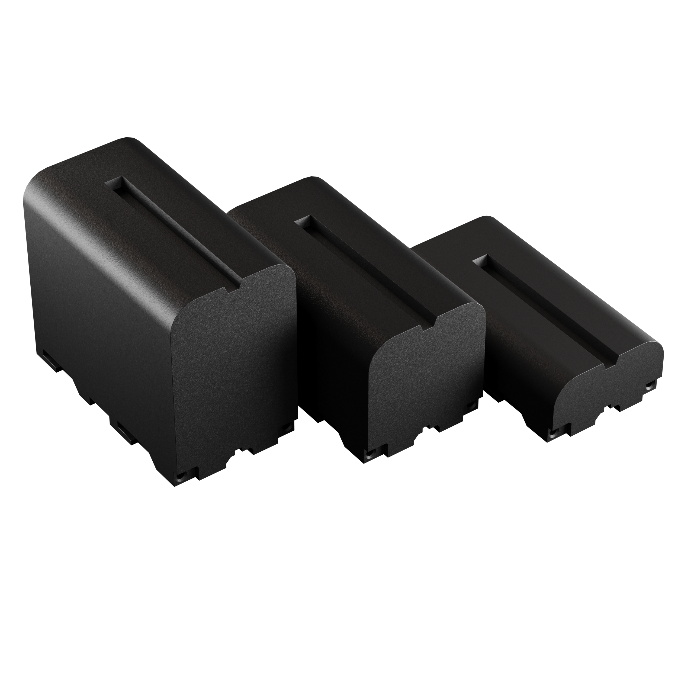
</p>

We chose the Sony NP-F battery system for a reason. These Li-ion cells are one of the most popular battery standards in the world, widely used in photography and videography equipment. You can buy them anywhere — online, in camera stores, globally. They come in multiple capacities to match your needs:

| Battery | Typical Capacity | Approximate Runtime* |
|---------|-----------------|---------------------|
| NP-F570 | 2900 mAh | Shorter runtime, most compact |
| NP-F770 | 5200 mAh | Mid-range |
| NP-F970 | 6600 mAh | Longest runtime |

*Runtime depends on your Raspberry Pi's workload and connected peripherals.*

Batteries are **hot-swappable** — you can replace them while the system is running, as long as external power is connected. No downtime, no shutdown. You can also mix and match different NP-F sizes depending on your use case.

### Single USB-C Cable for Power and Communication

Here's something most people don't know: the USB-C port on the Raspberry Pi 5 isn't just for power. It also supports USB data transfer when enabled in `config.txt`. Web3 Pi UPS takes advantage of this — **one USB-C cable carries both power delivery and a data channel** between the UPS and the Raspberry Pi.

This data link enables:

- **Graceful shutdown** — when battery reaches a critical level, the UPS tells the OS to shut down cleanly, preventing filesystem and database corruption
- **Real-time telemetry** — battery level, charging status, input source, voltage, current, and temperature are all accessible from the Raspberry Pi
- **Remote monitoring** — integrate UPS status into your monitoring stack (Grafana, scripts, etc.)

### Built-in User Interface

The UPS has an OLED display (SSD1306) and two tactile buttons for local status monitoring and configuration — no need to SSH in just to check battery level. An onboard buzzer provides audible alerts for power events.

<p align="center">
  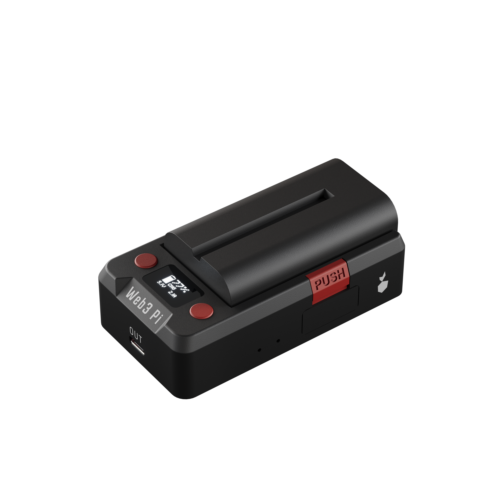
  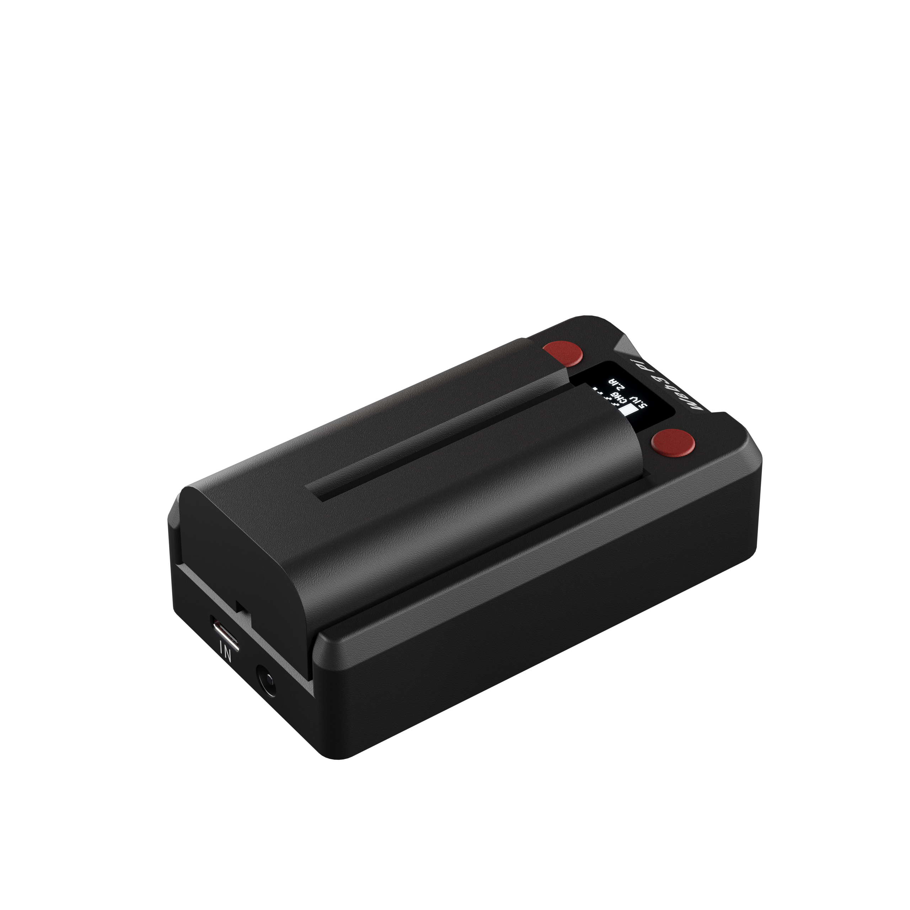
</p>

### USB-C PD Output

The output port supports USB Power Delivery with multiple voltage profiles:

- **5 V / 5 A, 9 V / 3 A, 12 V / 2.25 A, 15 V / 1.8 A** — four advertised profiles, up to **27 W**
- Fully compatible with Raspberry Pi 5 power requirements
- Also works with other USB-C PD powered devices

### Smart Battery Management

The onboard charger (MP2762A) handles 2S Li-ion charging with temperature monitoring via an LM75B sensor. The power path management reduces battery wear by limiting charge when the battery is full — extending its lifespan over hundreds of cycles.

## A Raspberry Pi for Raspberry Pi

A fun detail: the UPS uses a **Raspberry Pi RP2040** microcontroller for the UI panel and system monitoring. So it's a Raspberry Pi-powered device, built for Raspberry Pi.

The current rev.3 power board uses a **CH32X035** RISC-V MCU for USB-PD
output and power management. A separate **HUSB238** negotiates USB-C input
power. The RP2040 also routes the shared WUPS binary protocol between the
power controller, Raspberry Pi host service and optional LTE-M card.

### Optional LTE-M Expansion

The **W3P MODEM V1** M.2 card combines an **ESP32-S3** with a **SIM7080G**
modem. It provides telemetry, authenticated remote commands and ESP32/RP2040
firmware updates over MQTT, HTTP or Arkiv while operating independently of
the Raspberry Pi's local network. The current firmware targets **LTE Cat-M1
on B3/B20**. See the [LTE-M firmware README](firmware-ESP32-LTE-M/README.md)
for hardware details, APN profiles and update requirements.

<p align="center">
  <a href="docs/images/lte-m-module-perspective.png">
    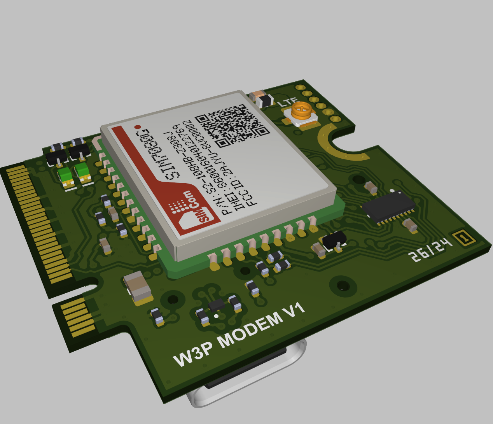
  </a>
</p>
<p align="center">
  <a href="docs/images/lte-m-module-modem-side.png">
    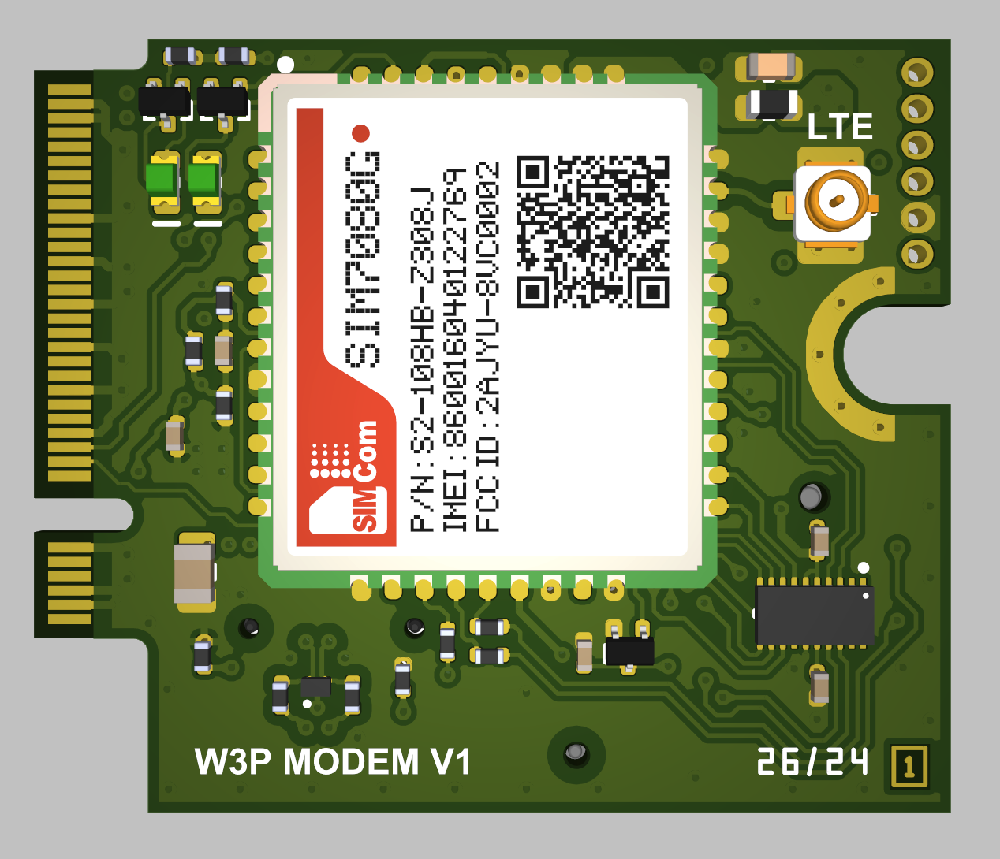
  </a>
  <a href="docs/images/lte-m-module-reverse.png">
    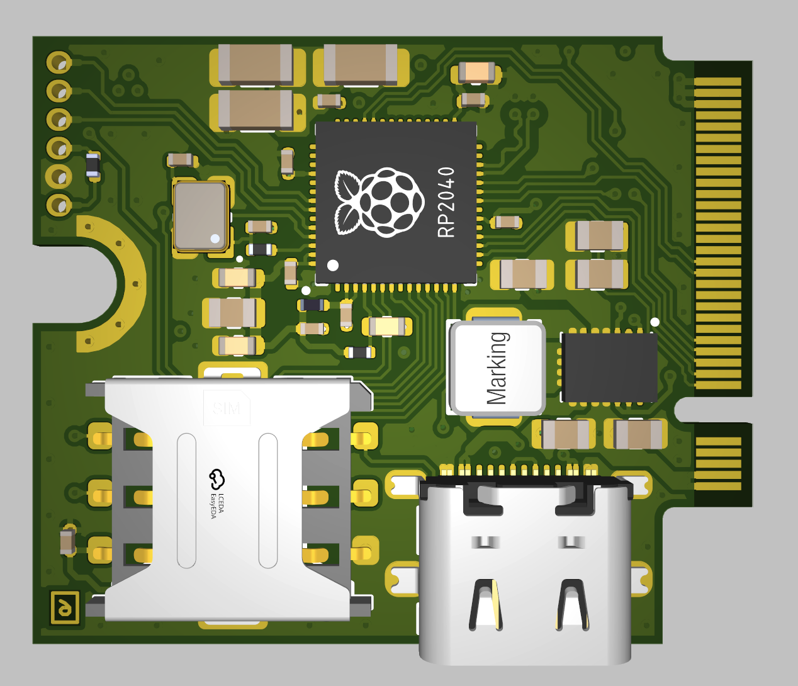
  </a>
</p>

*W3P MODEM V1 — 3D design renders. The RP2040 marking on the reverse-side
render differs from the current module's documented ESP32-S3 MCU.*

## Web Panel and Remote Management

The [Web3 Pi Control Panel](https://panel.web3pi.io) lets you monitor and
manage your UPS from a browser. With the LTE-M expansion, the UPS communicates
independently of the Raspberry Pi's local network.

<p align="center">
  <a href="https://panel.web3pi.io">
    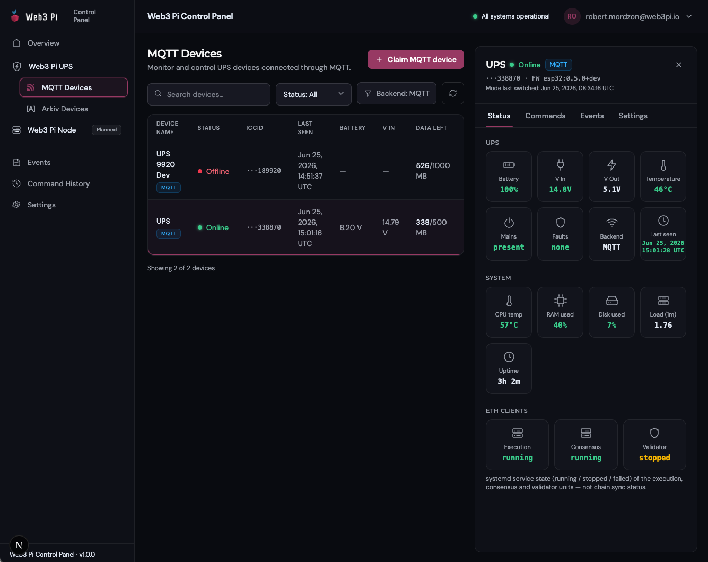
  </a>
</p>

*MQTT device list and status view, from the project documentation (June 2026).*

- **Live monitoring** — battery, input/output power, temperature, faults,
  LTE radio quality and remaining SIM data.
- **Raspberry Pi status** — CPU temperature, memory, disk, uptime and
  execution/consensus/validator service states, supplied by the
  [host service](https://github.com/Web3-Pi/Web3-Pi-UPS-Service).
- **Remote control and history** — manage the UPS output, reboot or shut
  down the Pi, start/stop/restart allowed services, and review events and
  command results.
- **Firmware updates** — update the ESP32 or RP2040 over LTE and follow
  update progress in the panel.

MQTT devices use an account and sticker claim token; Arkiv devices use
owner-wallet claims and encrypted telemetry. See the
[web panel guide](https://docs.web3pi.io/ups/connectivity/web-panel/) for
setup and the [panel repository](https://github.com/Web3-Pi/Web3-Pi-UPS-Panel)
for source code.

## Technical Summary

| Parameter | Specification |
|-----------|--------------|
| **Output** | USB-C PD: 5 V / 5 A, 9 V / 3 A, 12 V / 2.25 A, 15 V / 1.8 A |
| **Input 1** | USB-C PD through HUSB238; 9–20 V profile selection |
| **Input 2** | DC barrel jack (12–20 V) |
| **Input 3** | Sony NP-F battery (Li-ion, 2S) |
| **Battery** | Sony NP-F series — NP-F570 / NP-F770 / NP-F970 |
| **Hot-swap** | Yes (with external power connected) |
| **Communication** | USB data over the same USB-C power cable |
| **Display** | SSD1306 OLED |
| **Controls** | 2 tactile buttons + buzzer |
| **MCU (power)** | CH32X035F8U6 (RISC-V, USB-PD 3.0 PHY) |
| **MCU (UI / protocol router)** | Raspberry Pi RP2040 |
| **Optional connectivity** | W3P MODEM V1: ESP32-S3 + SIM7080G, LTE-M B3/B20 |
| **DC-DC** | TPS55289 buck-boost (3-30V range) |
| **Charger** | MP2762A (2S Li-ion, temp monitored) |
| **Enclosure** | 3D-printed (FDM), snap-fit assembly |

## Electronics

### Main Board

4-layer PCB with USB-PD controller, charger, DC-DC converter, and NP-F battery connector.

<p align="center">
  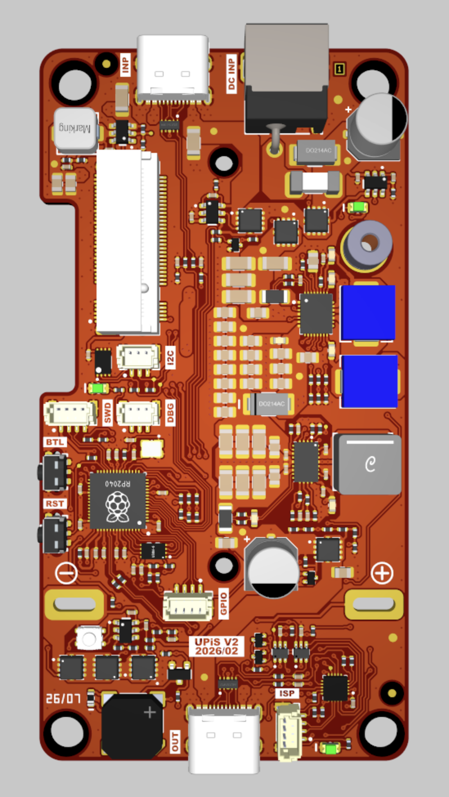
  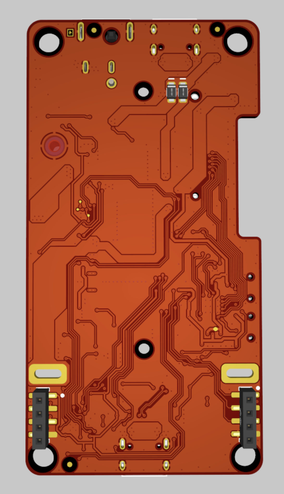
  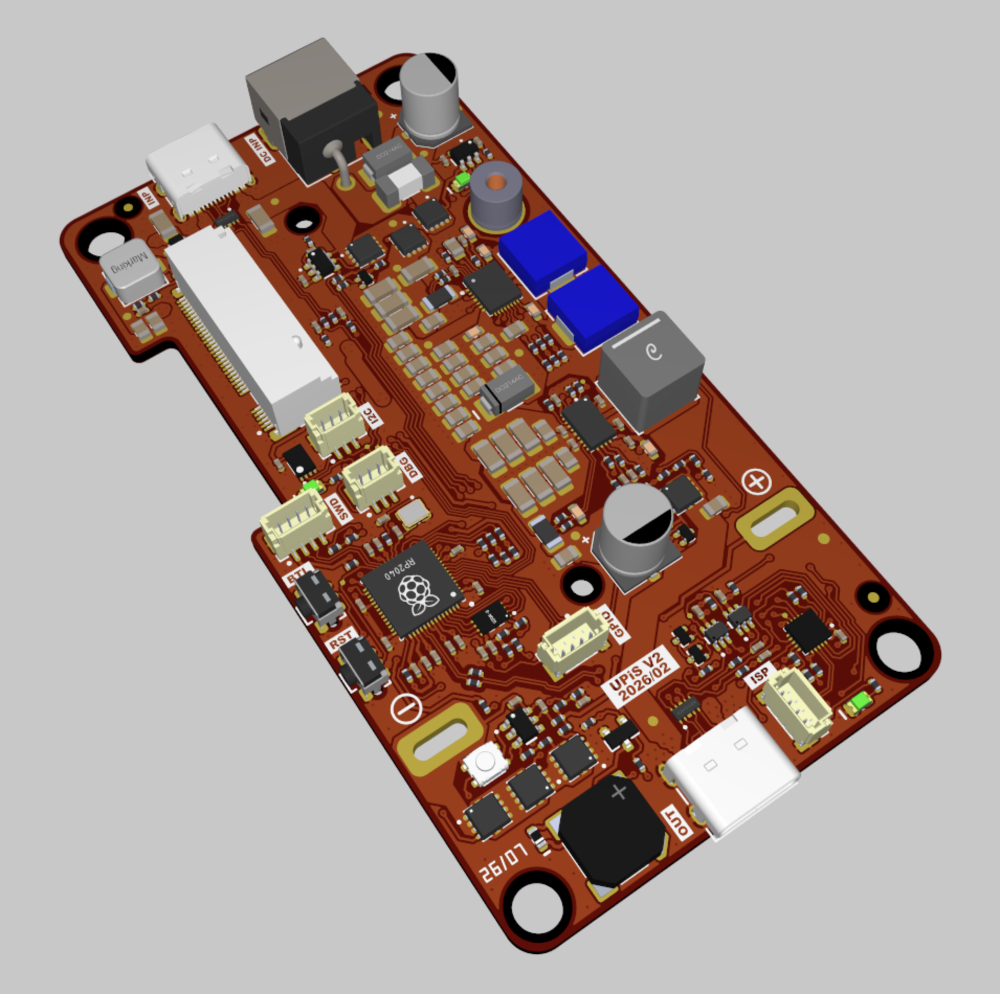
</p>

### UI Panel

2-layer PCB with SSD1306 OLED display, two tactile buttons, and RP2040 controller.

<p align="center">
  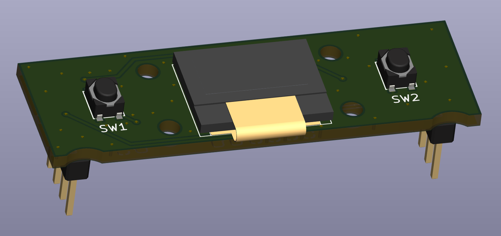
  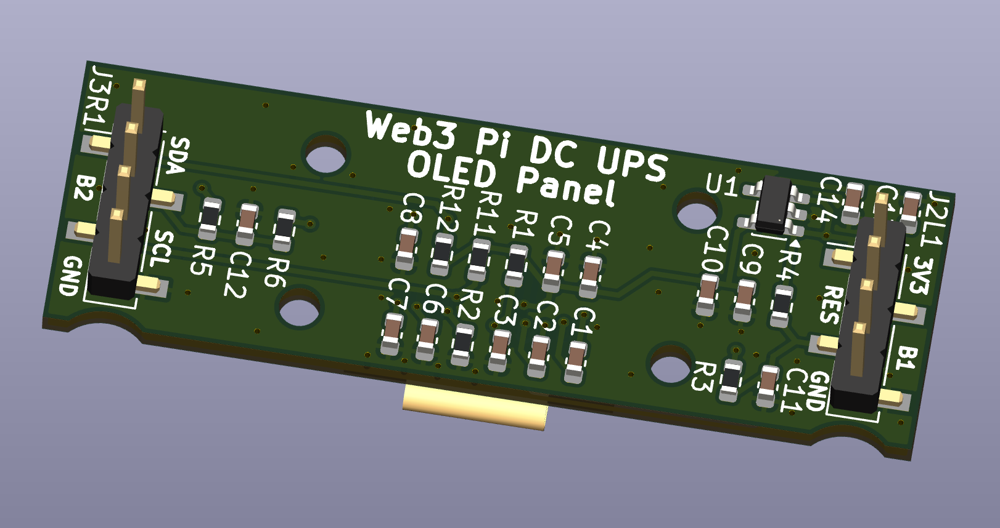
</p>

## Enclosure

3D-printed enclosure designed for FDM printing. Multi-part assembly with snap-fit battery latch.

<p align="center">
  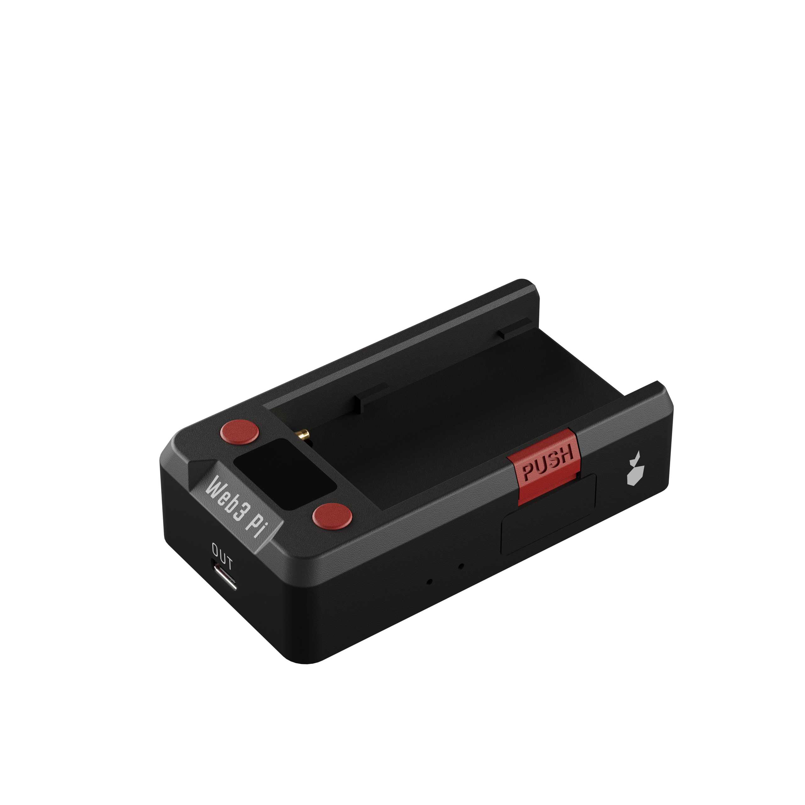
  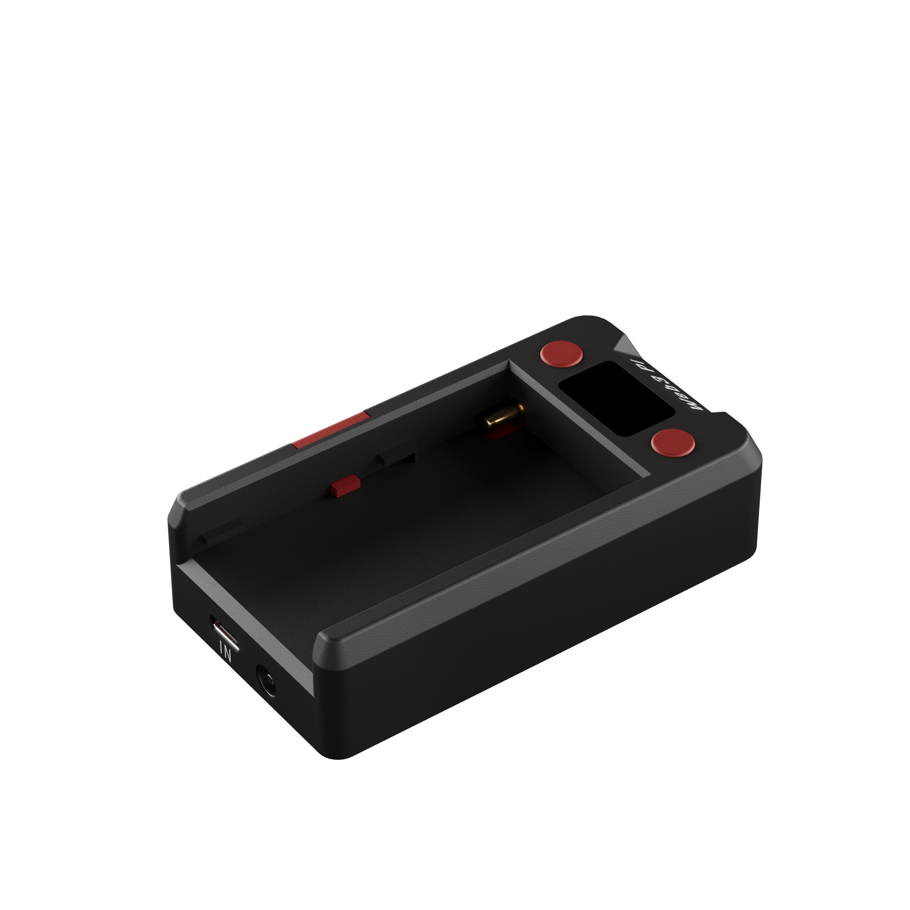
</p>

**Parts:** Enclosure Main, Enclosure Bottom, Side Cover, Buttons, Lock, Press Lock Button, OLED Dimmed Window

Full STEP assembly: [`hardware/enclosure/Web3_Pi_UPS_3DPrinted.step`](hardware/enclosure/Web3_Pi_UPS_3DPrinted.step)

## Repository Structure

```
firmware-ch32x/                     CH32X035 firmware — USB-PD source, power management
firmware-rp2040/                    RP2040 firmware — OLED UI, protocol router, local update receiver
firmware-ESP32-LTE-M/               ESP32-S3 firmware — LTE-M, backends, commands, OTA
common/                            Shared WUPS binary protocol and human-readable specification
tools/                             Host regression tests and development utilities
examples/http-control-server/      Reference HTTP backend
service/                           Historical placeholder; host service is a separate repository
hardware/
├── electronics/
│   ├── main-board/                 Main power board — schematic, STEP, Gerber, BOM, PnP
│   └── ui-panel/                   OLED + buttons panel — schematic, STEP, Gerber, BOM
└── enclosure/                      3D-printed enclosure — STEP assembly, STL parts
docs/images/                        Renders and photos
```

## Firmware and Builds

These are the versions declared in the current source tree; they do not
identify which firmware is installed on a particular device.

| Target | Source version | Build tool | Details |
|---|---|---|---|
| CH32X035 power controller | `ch32x:1.1.1` | WCH GCC / MounRiver Studio 2 | [README](firmware-ch32x/README.md) |
| RP2040 UI and router | `rp2040:1.2.4` | PlatformIO, arduino-pico 5.6.1 | [README](firmware-rp2040/README.md) |
| ESP32-S3 LTE-M card | `esp32:0.8.17` | ESP-IDF v6.0.2 | [README](firmware-ESP32-LTE-M/README.md) |

Build from this repository root, with the corresponding toolchain available:

```sh
# CH32X035: WCH riscv-none-embed-gcc, output in firmware-ch32x/build/
make -C firmware-ch32x

# RP2040: output in firmware-rp2040/.pio/build/pico/
pio run -d firmware-rp2040 -e pico

# ESP32-S3: activate ESP-IDF v6.0.2 first
cd firmware-ESP32-LTE-M
idf.py set-target esp32s3       # first build in a fresh checkout
idf.py build
```

Use each firmware README for flashing instructions and device-specific update
requirements. RP2040 1.2.4 defaults to OLED brightness **Lvl 1/6** and migrates
older saved brightness settings while preserving the sound preference. ESP32
0.8.17 uses 300-second MQTT deadlines and 5-second retransmission, building
on 0.8.16 bounded MQTT service and recovery fixes plus the CPU/UART work
from `research`; SINR telemetry and separately selectable fixed-APN builds
remain available. See the ESP32 README for persistent UART migration and
legacy downgrade requirements.

[GitHub Actions](.github/workflows/firmware-ci.yml) builds all three targets
and runs host regressions for MQTT, modem recovery, OTA and protocol handling.
CI builds the default automatic-APN ESP32 image; fixed-APN variants need their
own builds. CI does not flash hardware or establish field reliability.

## Protocol and Companion Projects

The canonical wire definitions are in [common/protocol.h](common/protocol.h),
with a [human-readable protocol guide](common/protocol_desc.md). USB-CDC and
MCU UART links carry binary WUPS frames.

| Project | Role |
|---|---|
| [Web3-Pi-UPS-Service](https://github.com/Web3-Pi/Web3-Pi-UPS-Service) | Raspberry Pi host agent, USB communication, host telemetry and graceful shutdown |
| [Web3-Pi-UPS-Panel](https://github.com/Web3-Pi/Web3-Pi-UPS-Panel) | Web dashboard, device telemetry and remote management |
| [Web3-Pi-UPS-Workbench](https://github.com/Web3-Pi/Web3-Pi-UPS-Workbench) | Local USB diagnostics, HTTP-mode configuration and firmware updates |

For a custom backend, see [HTTP control mode](docs/http-control-mode.md), the
[HTTP server example](examples/http-control-server/README.md) and
[MQTT server setup](docs/mqtt-server-setup.md).

## Links

- [Web3 Pi UPS — product page](https://www.web3pi.io/products/ups)
- [Web3 Pi UPS — video on YouTube](https://www.youtube.com/watch?v=3EgSPatHWfY)
- [Web3 Pi Control Panel](https://panel.web3pi.io)
- [Web3 Pi — project homepage](https://www.web3pi.io)

## License

This project uses dual licensing:

| Component | License | File |
|-----------|---------|------|
| Project firmware and software | [GPL-3.0](LICENSE-SOFTWARE) | `LICENSE-SOFTWARE` |
| `hardware/` | [CERN-OHL-S v2](LICENSE-HARDWARE) | `LICENSE-HARDWARE` |

Bundled third-party components retain their own license notices.

---

*Disclaimer: Raspberry Pi is a trademark of Raspberry Pi Ltd. Sony NP-F is a trademark of Sony Corporation. The use of these trademarks here is solely for descriptive purposes.*
